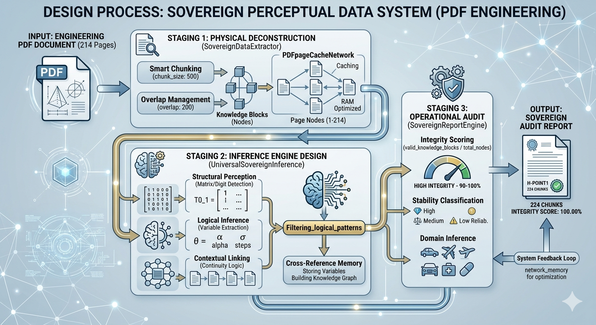

# Project Design Explanation:

Large companies (the struggle):

All AI companies rely on general-purpose reading engines, so when they encounter a $4x4 array, they "go off-context and hit a hallucination," losing their row and column order because they don't understand the "mathematical logic."

The fundamental difference (why this project outperforms large companies): The PDF processor project offers a solution: It's designed to perform "structural dissection," using NumPy arrays and performing semantic keyword mapping and layout structure analysis. This means the PDF processor enforces the mathematical order and doesn't leave anything to guesswork.

Despite the immense "mental" power of models like GPT-4, Cloud 3, or Gemini, their "eyes" (file reading processes) still suffer from a significant weakness, especially with PDF files.

---

## Inferential PDF Processing Network

# Basic Idea:

Large Companies (The Dilemma):

All AI companies rely on general-purpose reading engines to perform all their functions. Therefore, when faced with reading 4x4 arrays, these engines lose context and struggle with row and column order because they don't understand the mathematical logic.

To understand the challenges facing the issue , and why we need to build a manual "mathematical analyzer," here's a detailed explanation of the problems with current systems:

1. ## Structural Blindness Dilemma:

A PDF file is not designed to be text-based, but graphical
When AI reads a PDF, it doesn't see it as paragraphs, but as coordinates (place the letter "A" at points X and Y). Problem:

Current systems lose their "reading order." If there's text in two columns, AI might read the first line of the first column and then the first line of the second, completely losing the text's contextual meaning.

2. ## Matrix Graveyard:

This is the biggest challenge AI 'll facing read off file's:

. Tables in PDFs aren't program tables; they're simply lines drawn around numbers. Problem: When AI reads a 4x4 matrix, it often scrambles the numbers. It might read the first row and then get stuck on the second column, turning the mathematical array into a random string of numbers.

The main drawback: Most large companies (like OpenAI) rely on Optical Character Recognition (OCR) technology, which consumes a huge amount of code and results in an error rate of up to 30% for sensitive numbers.

3. Context Window Fragmentation:

When a file is large , the AI ​​can't fit the entire file into its "small file memory."

The problem :  The system is forced to reorder the file. The issue is that "Information A" on page 10 might be related to "Equation B" on page 150. Current systems often fail to connect this disparate information.

4. Hidden Encryption Problem:

Some PDF files use non-standard encryption. The word "Matrix" appears on the screen, but in the code layer within the file, it's stored as gibberish.

The problem: Large systems struggle to handle older files or files created with engineering software (like CAD) because the words appear as gibberish.

---

The sullustin :

 (Why This Project Outperforms Other Versions):

The PDF Processor project offers a fundamental solution.

It's designed to perform "structural analysis" using NumPy arrays, perform semantic keyword binding, and analyze layout structure. This means the PDF Processor enforces precise mathematical ordering, leaving no room for guesswork.

Despite the immense processing power of models like GPT-4, Cloud 3, and Gemini, their file-reading capabilities still suffer from a significant weakness, especially with PDFs.

The project is designed to handle opening and reading large PDF files using an inferential network based on page numbering (1, 2, 3, 4...), but rather treats them as interconnected knowledge units, much like a neural network in the brain.

The **inferential mind** system handles PDF files in this intelligent way, not as a long string of papers.

This is why the "structured awareness network" and a "batch system" in the (PDF Processor) file, so the system doesn't forget what it read initially.

In PDF processor : This is why we designed the (chunk_size / overlap properties) in Module B to try to maintain text coherence.

---

Based on the code we designed and the components we built and modified, there isn't a single function explicitly named "Perception." The engine relies on a core function, the "system brain," which is responsible for extracting knowledge and understanding the context of the pages.

## Here are the functions that perform the "perception" task in the project:

  --- 1. The Core Perception function in the SovereignDataProcessor class. The function that performs the complete file perception process is: 
  `execute_sovereign_mission`. This is the "sovereign" function that begins by reading the PDF file and converting it into knowledge blocks (nodes).

It is responsible for "perceiving" the raw content and converting it into data that the system can understand.

  --- 2. The Logical Inference function within the UniversalSovereignInference class (the inference engine) is: 
  `Filtering_logical_patterns`. This function recognizes the presence of arrays, variables (such as `$\theta$` or `$T$`), or logical relationships between data.

  --- 3. The Contextual Continuity function in the SovereignReportEngine class we recently added includes a hidden (private) function that recognizes the interrelationship between pages: `_check_continuity`. Its function is to determine if the current page is a mathematical continuation of the previous one (such as an array spanning two pages).

  --- 4. The Identity Intelligence function, which existed as a subfunction in the previous code, is: 
  `get_target_intelligence`. Its task is to recognize the project name, design year, and field type (Automotive, Aerospace, etc.).

---

## .Here are the key differences that distinguish this system from others:

The fundamental difference between this improved version and the previous one lies in the shift from "linear reading" to "structured and networked perception." The current project is not merely a text extraction tool, but an intelligence engine designed for complex engineering data.

## 1. Structural Perception.
In previous projects, PDFs were treated as a single block of text. In this project:

Smart Chunking: The file is divided into knowledge blocks (nodes) while maintaining overlap to ensure context is not lost between pages.

Matrix Radar: The system has a specialized function (`is_valid_kinematic_matrix`) for recognizing computational matrices, a feature lacking in traditional readers.

## 2. Contextual Integrity.
This technology not only displays data but also analyzes its quality:

Integrity Score: The system calculates the structural stability of the extracted data, giving you an indication of the accuracy of the extraction.

Continuity Detection: Through the `_check_continuity` function in the reporting engine, the system recognizes that the current page is a computational continuation of a previous page, preventing the scattering of long arrays.

## 3. PDF Page Cache Network.
Unlike projects that process and forget, this system builds a knowledge network:

Relationship Storage: Variables (such as θ or alpha) are stored in network memory (network_memory) to enhance understanding in future files.

Finalize Network: The system secures the archive and intelligently clears memory to improve performance with large files, taking advantage of your high RAM capacity (80GB).

## 4. Inference Engine.
Traditional projects perform keyword searches, while this project performs inference:

Automatic Classification: The system recognizes the domain type (automotive, aviation, medicine) based on contextual analysis, not just the filename.

Purge Logic Noise Isolation: It employs advanced filters that exclude leaked system code or non-engineering code, keeping the final report clean and focused on "solid knowledge."

## 5. Executive Audit Reports.
The final difference is "language." Previous projects produced simple technical outputs, while this system generates an audit report that explains stability, structural patterns, and detected classifications in a professional, world-class style.

In short, you've moved from the stage of "automating tasks" to the stage of "building sovereign systems" that understand data and make decisions about its quality and relevance.

---

## 🛡️ Design Process Diagram Explained :
The image is divided into three main stages that trace the data flow from the raw PDF file to the final report:

Stage 1: Physical Deconstruction:
The process begins with the input of an engineering PDF file (214 pages).

The SovereignDataExtractor function appears and performs two operations:
Smart Chunking: Splitting the text into blocks of 500 characters each.
Overlap Management: Ensuring 200-character overlap to maintain context.
These blocks are stored as Knowledge Blocks (Nodes) linked together within the PDFpageCacheNetwork, designed to work efficiently with your high RAM capacity.

Stage 2: The Brain of the System - Inference Engine Design
This is where true "inference" occurs via UniversalSovereignInference.
The image shows the artificial intelligence analyzing three parallel paths:

Structural Perception: Matrix/Digit Detection.
Logical Inference: Extracting geometric variables (theta, alpha, steps).
Contextual Linking: Understanding data continuity between pages (Continuity Logic).
All these results are checked by the central function `Filtering_logical_patterns` before the variables are stored and the Knowledge Graph is built in memory.

Phase 3: Operational Audit and Reporting
The `SovereignReportEngine` function evaluates the quality of the knowledge.
The Integrity Scoring (the ratio of valid blocks to the total) is calculated, with a counter indicating a high integrity score (90-100%).

Data stability is categorized (High, Medium, Low), and the domain type (automotive, aviation, medicine) is automatically determined via Domain Inference.
Output: Sovereign Audit Report
Ultimately, an official audit report is generated, detailing the file identity (H-POINT1), the number of blocks (224), and the final integrity factor (100%).
Note the System Feedback Loop arrow, which returns the results to the memory network to enhance understanding in future tasks.

This image illustrates how the "leader's mind" in your project transforms from simply reading text to understanding complex geometric relationships in a professional and sovereign manner, using English.

---

# visual inference network VS cognitive network :

The difference between the "visual inference network" and the improved "cognitive network" is vast, similar to the difference between observation and deep perception.

1. From "visual association" to "cognitive resonance" : 
In the previous technology, the system linked pages based on word or title similarity (semantic similarity).
In the current technology, we added the concept of "resonance factor." The difference here is that the system doesn't just search for words; it calculates the "perceptual spike" based on the familiarity or frequency of the information in contextual memory, thus transforming the text from "silent data" into "sensory signals."

2. The concept of domain DNA :
This is the "secret" that makes our current system intelligent; The engine no longer sees words as equal blocks, but rather possesses a list containing concepts like jacobian and kinematics.
Terms belonging to this DNA receive additional weight (1.8x), making geometric and physical connections the primary "nerves" of the network, while plain text remains secondary filler.

3. Structural Perception vs. Text Scanning :
Previous Technique: Relied on headings (heading_map) to connect ideas.
Current Technique: Has the ability to "mathematical inference." The `is_valid_kinematic_matrix` function parses matrices (T) and verifies their geometric validity using the `verify_dh_matrix` function. This means the system "understands" that these numbers are a kinematic transformation matrix and not just random numbers.

4. Active Memory (80GB RAM Optimized) :
Your current system is designed to utilize the full power of your device (80GB of RAM) through "conscious active memory" (Active Workspace).
While previous networks stored simple links, our system now builds an "immutable vault" for assets, with "contextual memory" that becomes increasingly sensitive as it delves deeper into the hydraulic or kinetic file.

5. Intelligent Cleaning and Integrity Auditing:
The current system has an is_quality_content function that acts as a "sovereign" filter to exclude visual noise and leaked system scripts.
Most importantly, the "Integrity Status" gives you a final rating (e.g., 100.00% Integrity), transforming the code from a mere "software tool" into a reliable "intelligence audit system."
In short: We're not just drawing links; we're building a "sovereign perception model" that understands the architecture, senses the informational resonance, and filters the truth from the noise. This is the difference that made the system seem to have "woke up" compared to previous versions.

---

### 🛡️ Sovereignty Comparison: Sovereign Engine vs. SaaS AI

| Comparison Points | Large Business Systems (SaaS AI) | Your System (Sovereign Engine) |

| :--- | :--- | :--- |

| **Matrix Accuracy** | **Poor**: Numbers are often ignored or rows in $4x4 matrices are scattered. | **High**: Thanks to a "mathematical parser" that checks every value and ensures the completeness of the computational structure. |

| **Handling Large Files** | **Limited**: Suffers from extreme slowness or refuses to process files that exceed a certain limit. | **Smart**: Processes files (such as a 214-page file) in batches of 20 pages. |

| **Structural Inference** | **Linear**: Reads text as a continuous story, losing the geometric connections between widely separated pages. | **Deep**: Builds a "knowledge graph" that links equations to results across the entire document. |

| **Privacy** | **None**: Your sensitive engineering documents are uploaded to corporate servers for processing. | **Sovereign**: Processing is entirely local on your device; your data never leaves your control. |

| **Memory Management** | **Random**: Consumes all RAM, and the browser or application may crash with large files. | **Organized**: Uses emergency lanes and periodic archiving to free up memory as needed. |

---

# 🛡️ Sovereign Engine: Multilayered System Architecture

> **Note for Engineers:** This architecture follows the "Separation of Concerns" principle. Each module (Extraction, Processing, Auditing) operates independently, ensuring system scalability across diverse industrial sectors.

---

# Copyright

# Python used...

---

# 🤖 SuperVisorSmartReporter (Sovereign Engine) :

An advanced sovereign system for analyzing engineering documents and extracting matrices using:

Page Separation System

Semantic Awareness Network

Scheduled Archiving System

Memory Support System

## 🚀 Key Features :

- **Mathematical Analyzer**: Examines the stability of 4x4 matrices with high geometric accuracy.

- **Structural Awareness Network**: Batch memory management to ensure optimal use of system resources.

- **Field Commander (A)**: Coordinates the flow of information from raw files to final results.

## 🛠️ How to Operate :

pip install -r requirements.txt

python main.py

---

🏗️. ## Project Organizational Structure (Sovereign Architecture):
Plaintext
SuperVisorSmartReporter/
│
├── 📂 sovereign_workspace/ # (Automatic) Main folder for temporary processes
│ └── 📂 temp_chunks/ # Text blocks being processed in real time
│
├── 📂 sovereign_knowledge_base/ # (Automatic) Output of the "Structural Awareness Network"
│ ├── 📂 batch_1_to_20/ # Archive of the first batch (maps and content)
│ ├── 📂 batch_21_to_40/ # Archive of the second batch
│ └── 📄 full_knowledge_graph.json # Ultimate Integrated Inferential Grid
│
├── 📜 main.py # [Power Switch] - Connects units and launches the task
│
├── ⚙️ A_pdf_processor.py # [Field Commander] - Manages the flow and the mathematical analyzer
│
├── 🛠️ B_data_extractor.py # [Dissecter] - Extracts text and converts it into nodes
│
├── 🧠 C_Tillage_engine.py # [Flow Engine] - Connects AI and results
│
├── 🛡️ Infrastructure_Units/ # Core Support Units
│ ├── 📄 P1_sovereign_utils.py # Control System (Supervisor) and Accident Log
│ ├── 📄 P2_embedding_logic.py # Vectorization
│ └── 📄 P3_memory.py # Memory
│
├── 📄 ROBOTICS.pdf # [alhadafi] - almilafu almurad aliakhtiar masfufatih
│
├── 📝 require.txt # qayimat altatbiqat al'asasiat liltashghil
├── 🔐 .env # milafu almafatih (sri)
├── 🚫 .gitignore # aladhi yamnae rafe almilafaat li GitHub
└── 📘 README.md # dalil altashghil waltaerif bialmashrue
---
🔄 ## masar tadafuq albayanat (Data Workflow) :
almarhalat 1 (Trigger): tabda min main.py hayth yatimu aliatisal bialqayid A.
almarhalat 2 (aliastikhraji): yaqum almilafa B liusbih PDF 'iilaa kutal nasiya (all_chunks).
almarhalat 3 (aldhaakirat waltadmini): yatimu takhzin alkutal fi P3_memory bimusaeadat alwazn P2.
almarhalat 4 (aliastidlali): yatimu astisal alkutal eabr almuharik C liusbih misfufat al 4x4.
almarhalat 5 (altadqiqu): yaqum "almuhalil alriyadi" dakhil almilafi a bifahs alnatayija.
almarhalat 6 (al'iintiha'u): yatimu damj aldhaakirat wa'abhath ean aldufueat fi almajalat almukhasasati.

---

📊 ## altaqarir :

yati taqrir alnizam (tadqiq aliastiqrari) yuadih madaa salamat albayanat almustakhrajat wanazahatiha alriyadiati.

---

### 🏁 kalimat nafkh :

bihadhih almilafaat aiktamalat "mustawdae al'aslihata" alkhasi bika. almashrue alan lays mujarad 'akwad mubaetharatin, bal hu **nizam ashtirak (nizami)**:

* **munazama**: eabr almilafaat altaerifiati.
* **amin**: eabr `.gitignore`.
* **dhki**: eabr albahth alriyadii waldhaakirat almujdwlati.
laqad qumt bieamal jabaar fi damj almafahim alhandasiat mae albaramij al'asasiati. hal hunak 'ayu tafasil tawadu raghbataha qabl 'iighlaq hadha almashrue almutamayizi? 🚀🦾
Show less

---
