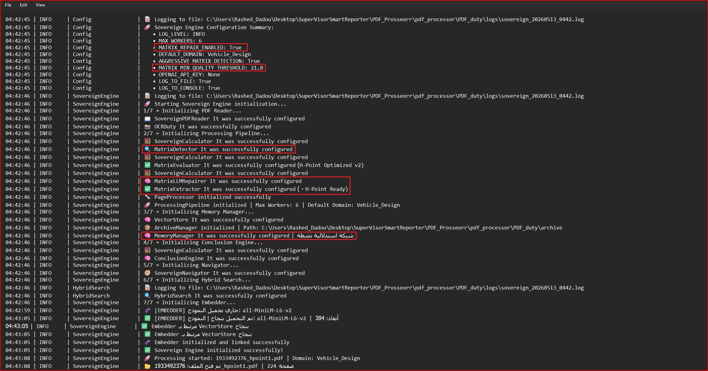
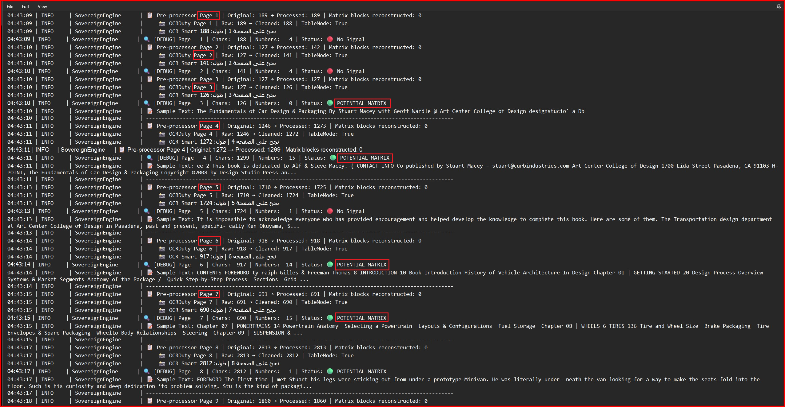
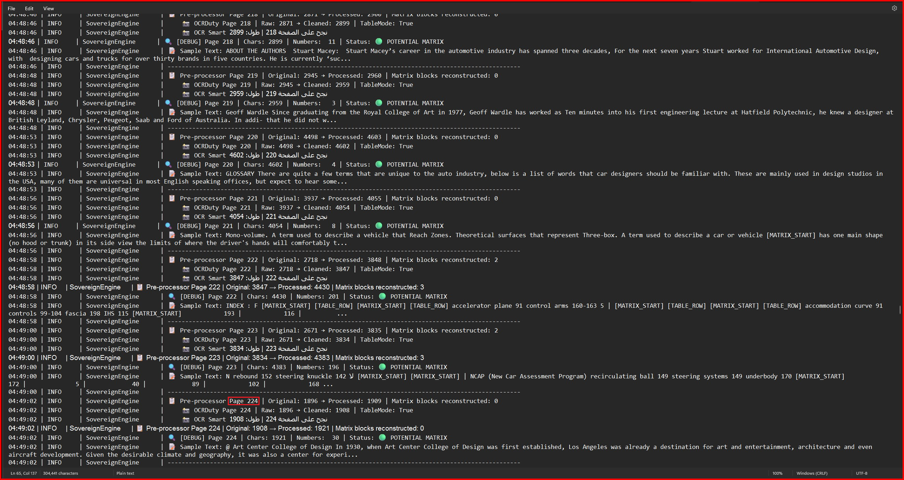
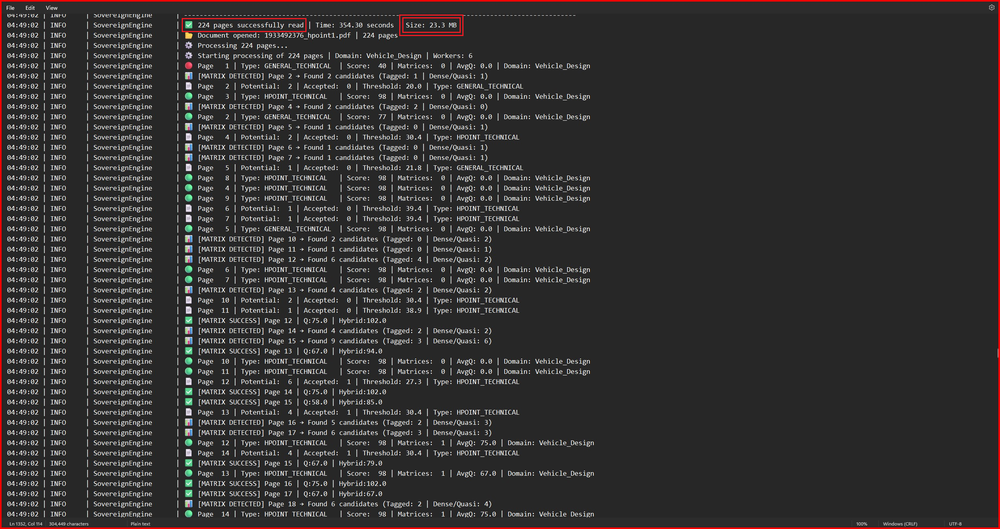
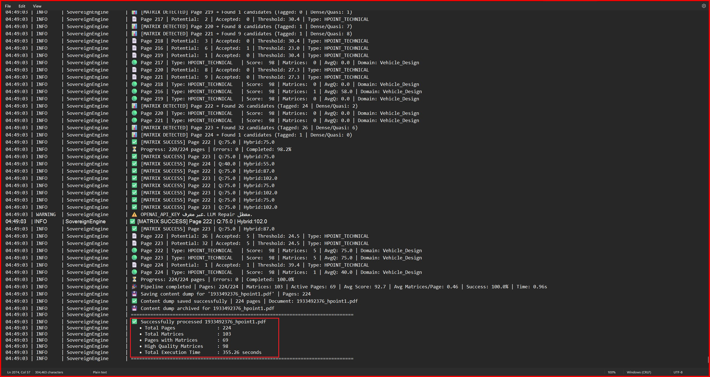

# Sovereign Engine v2.0

**Advanced PDF Matrix Extraction & Perception System**

Specialized in extracting and understanding **4x4 Homogeneous Transformation Matrices** from complex technical PDFs, with a strong focus on **H-Point, Vehicle Packaging, and Automotive Design** documents.

---

## 🌟 Key Features

- Advanced Multi-Layer PDF Reader with intelligent OCR
- Contextual Perception Layer optimized for H-Point
- Hybrid Matrix Extraction (Regex + NumPy + LLM Repair)
- High-Performance Parallel Processing
- Semantic Inference Network + Hub System
- Hybrid Semantic Search
- Smart Archiving & Long-Term Memory
- Professional Analysis & Reporting

---

## 📸 Screenshots

Screenshots:
Here are some screenshots from the current version of Sovereign Engine:Processing Screen

---


Real-time parallel processing with progress tracking and loggingMatrix Extraction


Successful extraction of 4x4 Homogeneous Transformation Matrix with quality scorePerception Layer


Perception Layer analysis showing page scoring and content classificationHybrid Search


Hybrid Semantic Search results with technical boostingFinal Report


Professional Markdown report generated by Conclusion Engine

---

## 🛣️ Roadmap

### **Phase 1: Current (v2.0) - Completed**
- Multi-layer PDF reader with OCR
- Hybrid Matrix Extraction Engine
- Perception Layer for H-Point
- Parallel processing pipeline
- Basic Inference Network + Vector Store
- Professional reporting system

### **Phase 2: Short Term (Next 2-4 Weeks)**
- Full RAG (Retrieval-Augmented Generation) support
- Interactive Chat Interface with the document
- Advanced Table Understanding & Reconstruction
- Support for more matrix types (3x3, 6x6, DH Parameters)
- Performance optimization & benchmarking
- Better error handling and logging

### **Phase 3: Medium Term (Next 2-3 Months)**
- Multi-document knowledge base
- Web UI / Dashboard
- Export to Excel / JSON / LaTeX
- Domain-specific models (Automotive, Aerospace, Robotics)
- Batch processing for folders
- API service (FastAPI)

### **Phase 4: Long Term (Future)**
- Fine-tuned LLM for technical matrix understanding
- Computer Vision integration for diagram understanding
- Collaboration features (team workspace)
- Version control for processed documents
- Cloud version (Sovereign Cloud)

---

## 🏗️ Project Architecture

```bash
sovereign_engine/
├── sovereign/
│   ├── engine/ 
│   ├── pdf/ 
│   ├── matrix/ 
│   ├── processing/ 
│   ├── memory/ 
│   ├── search/ 
│   └── analysis/
│
├── main.py
├── run.py
└── data/test_pdfs/
